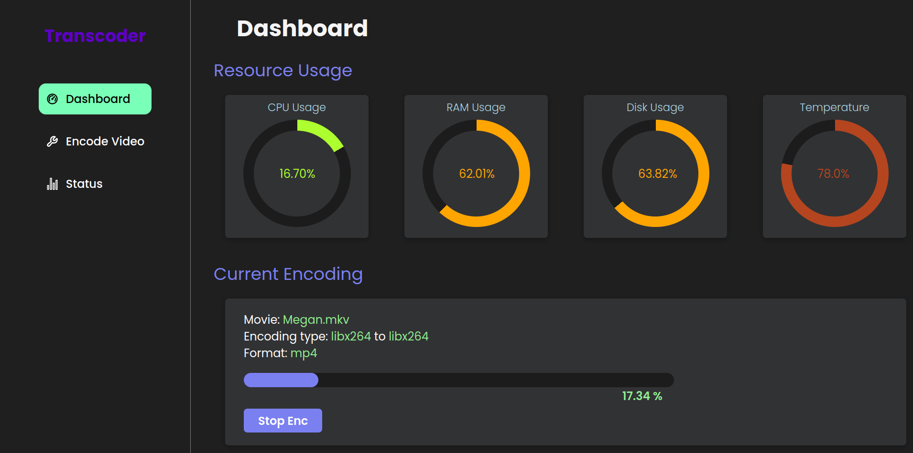
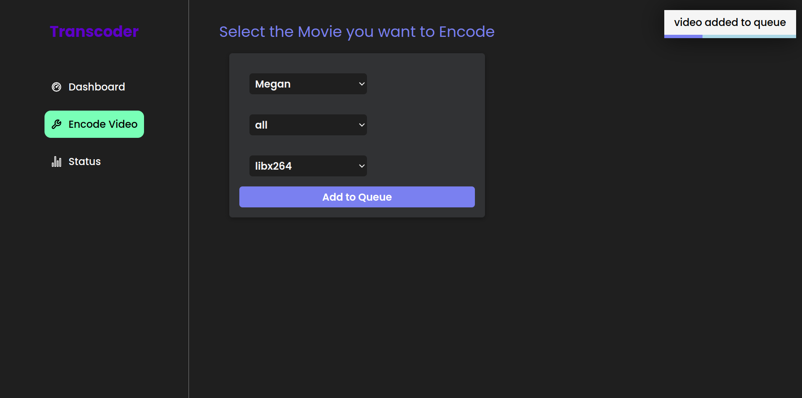
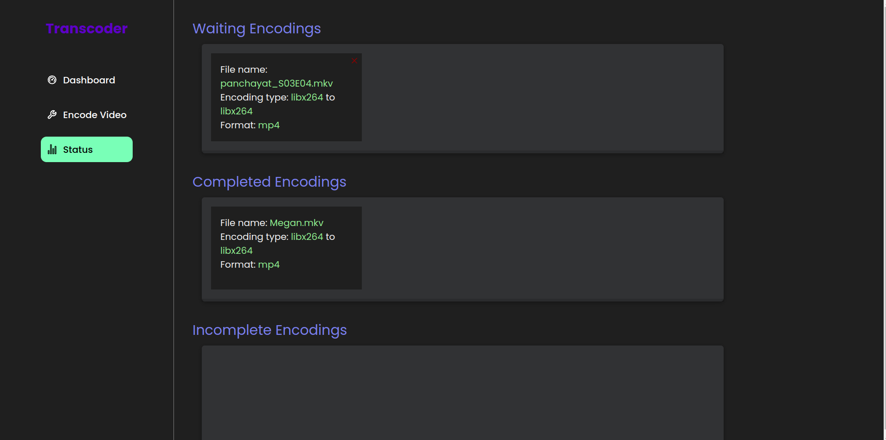

# Hobby Web Application for Video Conversion and encoding.

This hobby web application is designed to convert x265 MKV video files to x264 MP4 format using ffmpeg, embed multiple subtitles and audio files into the resulting MP4, and ensure efficient streaming compatibility with browser-supported video on a personal media server. The application uses React for the frontend and Node.js and ffmpeg lib in the backend.

## Features

- Convert x265 MKV video files to x264 MP4 format.
- Embed multiple subtitles and audio files into the resulting MP4.

## Installation

### Prerequisites

- Node.js
- npm (Node Package Manager)
- ffmpeg
- lm-sensors

### Steps

1. **Clone the Repository**

   ```bash
   git clone https://github.com/yourusername/your-repo-name.git
   cd your-repo-name
   ```

2. **Install Dependencies**

   Navigate to the backend directory and install the dependencies:

   ```bash
   cd backend
   sudo apt install lm-sensors
   npm install
   ```

   Then, navigate to the frontend directory and install the dependencies:

   ```bash
   cd ../frontend
   npm install
   ```

3. **Configure ffmpeg**

   Make sure `ffmpeg` is installed and accessible in your system's PATH. You can download it from [ffmpeg.org](https://ffmpeg.org/download.html).

4. **Set Up Environment Variables**

   Create a `.env` file in the `backend` directory and add necessary environment variables:

   ```plaintext
   PORT=6001
   CPU_CORES=8 #specify the number of cores as per your machine
   ```

5. **Run the Application**

   Start the backend server:

   ```bash
   cd backend
   npm start
   ```

   Start the frontend development server:

   ```bash
   cd ../frontend
   npm start
   ```

6. **Access the Application**

   Open your browser and go to `http://localhost:3000`.
   Enter the admin ==username: admin and password: admin==

## Usage

1. **Store the mkv file to be converted into the media/videos folder **

2. **Configure Subtitles and Audio click on encode video**

3. **Watch the encode status and watch all the completed, waiting, error encodes**

## Screenshots

### Dashboard



### Encode video page



### Encode queue waiting encodes



## Contributing

Contributions are welcome! Please open an issue or submit a pull request for any improvements or bug fixes.

## Acknowledgements

- [ffmpeg](https://ffmpeg.org) for the powerful multimedia processing capabilities.
